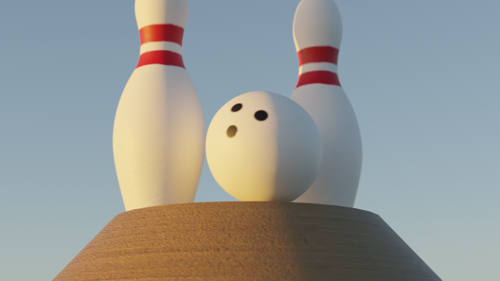
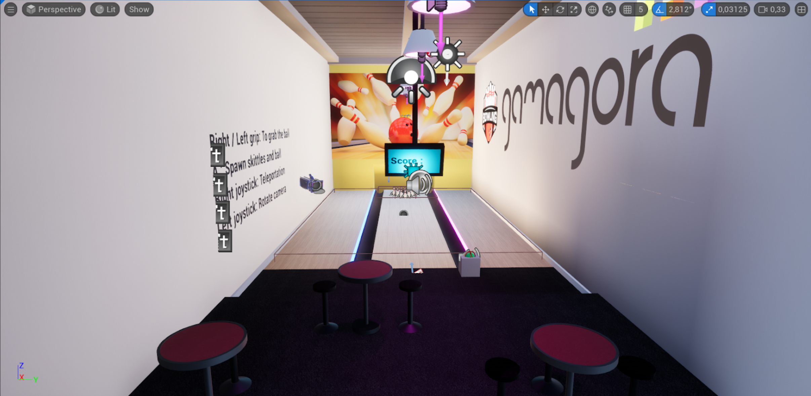
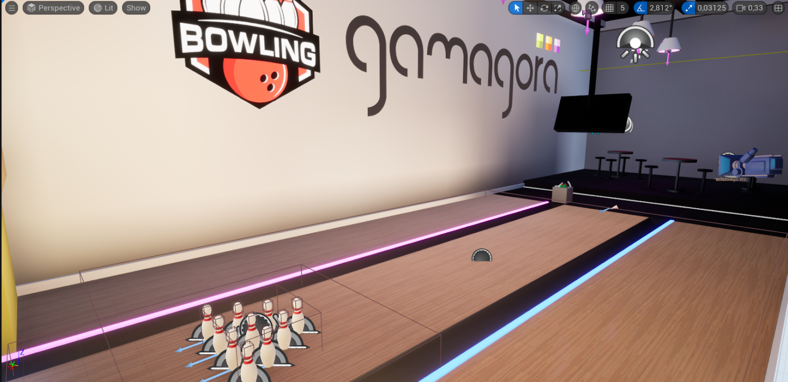

# Game_Bowling_VR

## Description
Bowling Gamagora est un projet en VR réalisé sur Unreal Engine 5 avec l’aide d’un Meta Quest 2. Le but de ce projet est de créer une simulation réaliste du jeu de bowling, en permettant aux joueurs de ressentir l’excitation du lancer de boules dans une atmosphère électrique tout en étant dans leur propre maison.

## Fonctionnalités

Travail réalisé personnellement :
- Création de certains assets en utilisant le logiciel de modélisation 3D Blender
- Ajout et affinage de la physique et des collisions pour les rendre réalistes

Autres fonctionnalités :
- Comptage et affichage du score
- Remise à zéro de la partie
- Sons d'ambiance et bruitages

## Visuels

Voici un aperçu des éléments modélisés sur Blender :

Ainsi que plusieurs images du jeu :

## Installation
Ce projet peut être ouvert directement en utilisant Unreal Engine 5, en ouvrant le fichier `Bowling_VR.uproject` dans le logiciel.

## Auteurs
Ce projet a été réalisé par Baptiste Clochard, Manon Bonnot, Souad Merbouti, Thomas Lieghio en deuxième année de Master 2 Ingéniérie du jeu vidéo (Gamagora).

## Licence
Ce projet a été réalisé dans un cadre pédagogique.
